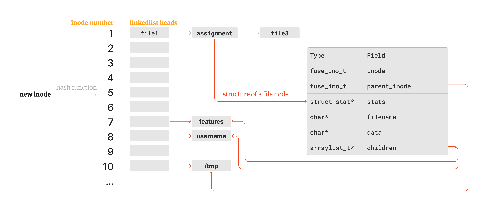

# Assignment: Filesystem

Student: Zhen Guan (202191382)

---

## Features

```c
static const char* features = 
    "Features: \n"
    "1. Core functions\n"
    "2. Directory listing\n"
    "3. Directory create and remove\n"
    "4. File create and unlink\n"
    "5. File modification"
    "6. Permission manipulation\n";
```

## Ideas



### Data Structure

- HashMap (key=inode number, value=file node struct)
- ArrayList (children inode numbers)

### File Node Struct

- inode number
- parent inode number
- stats struct
- file name
- file binary data
- children inode numbers (using self-implementation ArrayList)

### HashMap

- Linear array + hash function + linked list
